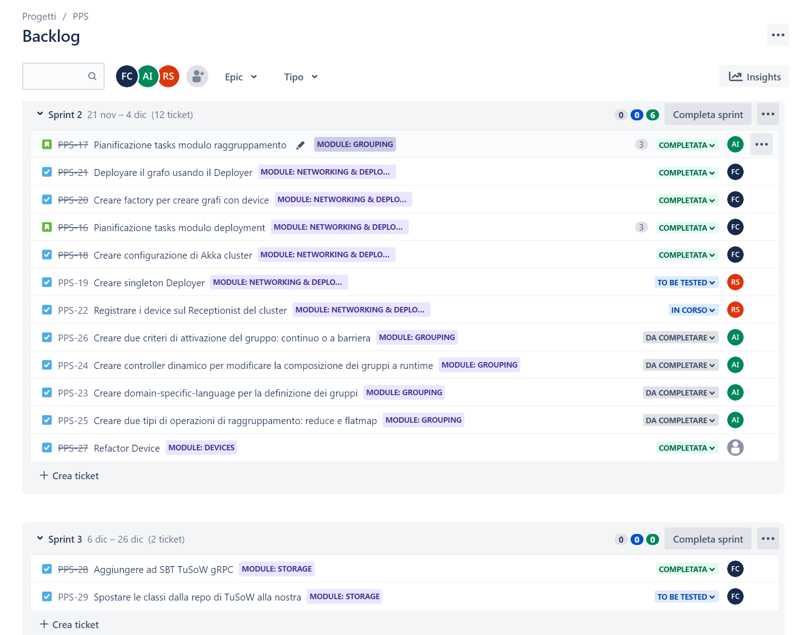
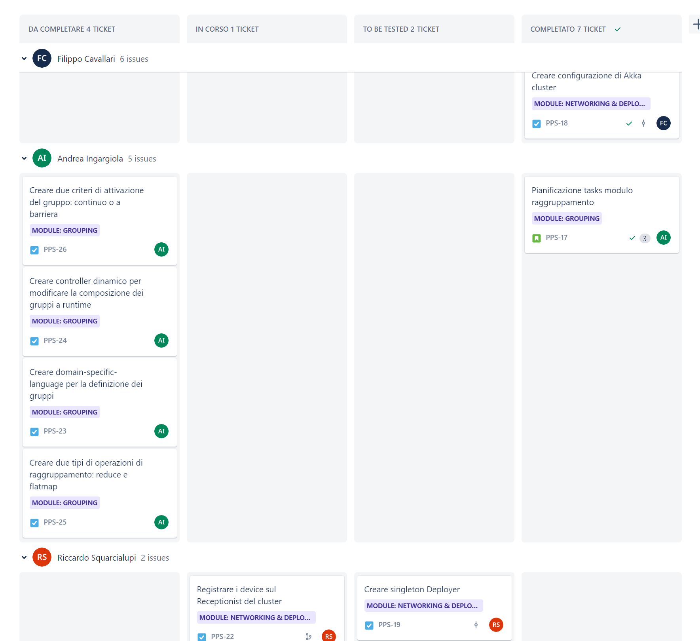

## Processo di sviluppo adottato

Come processo di sviluppo è stato adottato Scrum, un framework agile per la gestione del ciclo di sviluppo del software, iterativo ed incrementale.
Sono state quindi pianificate tre tipologie di riunioni:
* Sprint planning: una riunione dedicata alla pianificazione della sprint successiva, solitamente tenuta ad inizio settimana
* StandUp meeting: meeting giornaliero per discutere di quanto è stato svolto e di cosa ci si occuperà in giornata; molto utile per trovare criticità e tenere aggiornato l'intero team sull'avanzamente del lavoro
* Sprint review: riunione tenuta al termine di una Sprint per valutare le perfomance del team, cosa ha funzionato e cosa è migliorabile

Le Sprint hanno una durata media di due settimane, in cui idealmente nella prima settimana si completa l'implementazione e nella seconda si effettuano test, code review e polishing.

Come strumento di gestione delle Sprint abbiamo utilizzato Jira, un software sviluppato dall'Atlassian (la stessa che sviluppa Confluence e Bitbucket) che offre avanzati strumenti di project management per team agile.

Sono stati utilizzati quattro tipi di ticket:
* Task: il ticket principalmente più utilizzato e che identifica un risultato da implementare/realizzare
* Story: a livello pratico è identico al task ma concettualmente indica un risultato da raggiungere dal punto di vista del cliente o ad un livello di astrazione più alto (e.g. pianificazione di un componente)
* Bug: ticket utilizzato per il bug-tracking
* Epic: è un ticket utilizzato per raggruppare più task/story e definire limiti temporali (e.g. diagramma di Gantt); è stata utilizzata per raggruppare i vari ticket in base ai moduli di appartenza e stimare il tempo necessario per la realizzazione del progetto.

I ticket vengono creati, assegnati e gestiti dal product backlog, uno degli artefatti del framework Scrum.

Sempre dal backlog è possibile definire ed avviare le Sprint. Quest'ultime utilizzano quattro colonne diverse per indicare lo stato di lavoro di un ticket: da completare, in corso, to be tested, completato.

